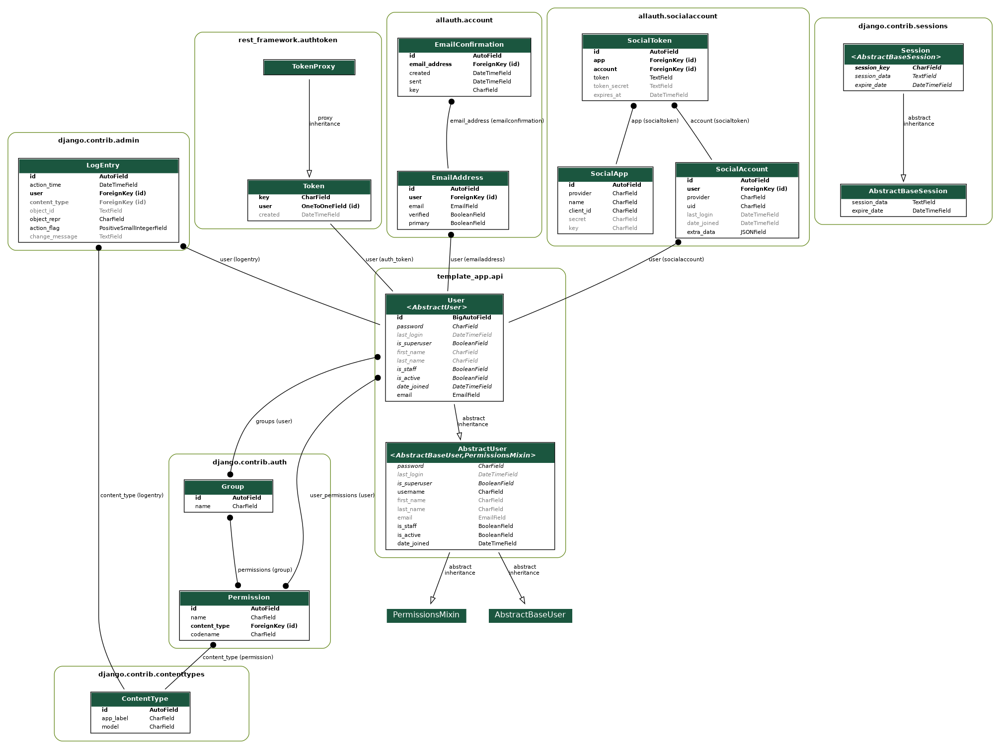

# UeventUplanner Development Guide

This application serves as a portal for users, integrating social login capabilities with features like Google OAuth. Whether you're running the development server or integrating social login, this guide provides the necessary steps.

Now a section about the initial set up of the project.

## 🪡 Template's usage

This template is meant to be used as a starting point for new projects.

To use it, follow these steps:

1. Clone this repository
2. Run `./scripts/init.sh`
3. Delete this section from the README
4. Add the new repository as a remote and push your changes
    - `git commit -am "Initial commit"`
    - `git remote add origin <your-repository-url>`
    - `git push -u origin master`
5. Start coding!

## 🤳 Model Diagram



## ⚙️ Configuration

Make sure there's a `.env` file at the root directory with the following keys:

```bash
DATABASE_URL=
SOCIAL_ACCOUNT_GOOGLE_CLIENT_ID=
SOCIAL_ACCOUNT_GOOGLE_CLIENT_SECRET=
SOCIAL_ACCOUNT_CALLBACK_GOOGLE=
... # Include other necessary keys
```

## 🚀 Usage

To open a shell or get the server up and running, use the commands provided:

### 1. **Open shell**
Migrate your database changes:

```bash
poetry run ./manage.py shell_plus --print-sql
```

### 2. **Run Development Server**
Start the development server and monitor SQL queries:

```bash
poetry run python ./manage.py runserver_plus --print-sql
```

## 🛠️ Pre-commit Hooks

Adhere to our code standards with `pre-commit` hooks. These automate linting, formatting, and other quality checks.

### Manual Checks

To run checks without committing:

```bash
poetry run pre-commit run --all-files
```

## 🤝 Development and Contribution

Let's keep our application growing! To contribute:

1. Clone the repo
2. Create a new branch (`git checkout -b feature/your-feature-name`)
3. Implement your feature or bugfix
4. Add and commit your changes (`git commit -am 'Add some feature'`)
5. Push to your branch (`git push origin feature/your-feature-name`)
6. Create a new Pull Request

Remember, maintain our code's integrity by sticking to existing standards and testing thoroughly.

---

Happy coding! If you face any issues, raise them in our repository's Issues section.
